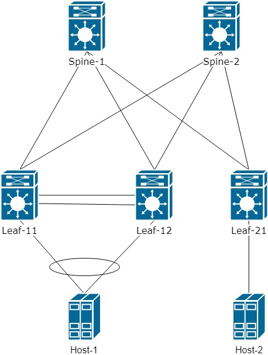
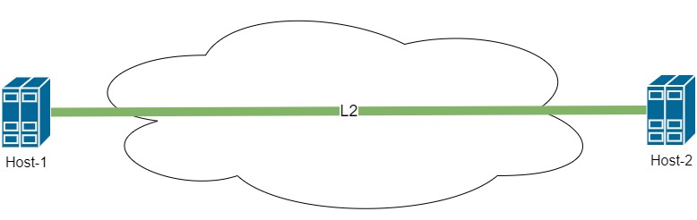
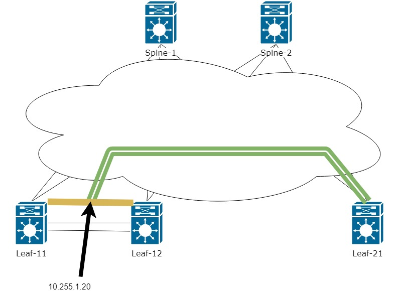
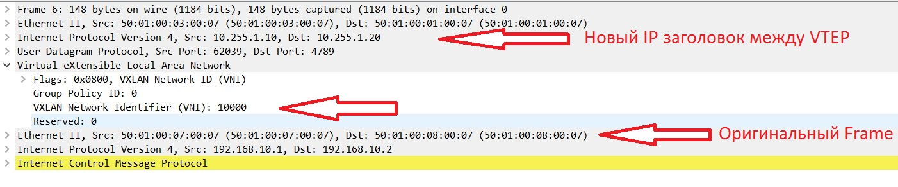
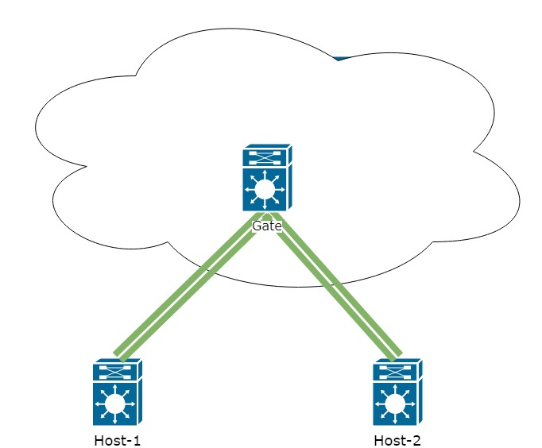

В первой части цикла статей по технологии VxLAN EVPN хочу рассмотреть технологию и способ организации L2 связанности между 
хостами поверх сетевой фабрики.

Все примеры будем выполнять на образах Cisco Nexus 9000v, собранных в топологию Spine-Leaf. Останавливать на настройке Underlay сети 
в рамках этой статьи мы не будем. 

Используемая топология выглядит следующим образом:



Зададим адресацию на всех устройствах:
```buildoutcfg
Spine-1 - 10.255.1.101
Spine-2 - 10.255.1.102

Leaf-11 - 10.255.1.11
Leaf-12 - 10.255.1.12
Leaf-21 - 10.255.1.21

Host-1 - 192.168.10.10
Host-2 - 192.168.10.20
```
Проверим что есть IP связанность между всеми устройствами

```buildoutcfg
Leaf21# sh ip route
<........>
10.255.1.11/32, ubest/mbest: 2/0
    *via 10.255.1.101, Eth1/4, [110/81], 00:00:03, ospf-UNDERLAY, intra
    *via 10.255.1.102, Eth1/3, [110/81], 00:00:03, ospf-UNDERLAY, intra
10.255.1.12/32, ubest/mbest: 2/0
    *via 10.255.1.101, Eth1/4, [110/81], 00:00:03, ospf-UNDERLAY, intra
    *via 10.255.1.102, Eth1/3, [110/81], 00:00:03, ospf-UNDERLAY, intra
10.255.1.21/32, ubest/mbest: 2/0, attached
    *via 10.255.1.22, Lo0, [0/0], 00:02:20, local
    *via 10.255.1.22, Lo0, [0/0], 00:02:20, direct
10.255.1.101/32, ubest/mbest: 1/0
    *via 10.255.1.101, Eth1/4, [110/41], 00:00:06, ospf-UNDERLAY, intra
10.255.1.102/32, ubest/mbest: 1/0
    *via 10.255.1.102, Eth1/3, [110/41], 00:00:03, ospf-UNDERLAY, intra
```
Как видим, от одного Leaf до других Leaf коммутаторов у нас есть по два пути через 2 Spine.

Проверим, что VPC домен создан и оба коммутатора прошли проверку консистенции и настройки на обеих нодах идентичны:
```buildoutcfg
Leaf11# show vpc 

vPC domain id                     : 1
Peer status                       : peer adjacency formed ok
vPC keep-alive status             : peer is alive
Configuration consistency status  : success
Per-vlan consistency status       : success
Type-2 consistency status         : success
vPC role                          : primary
Number of vPCs configured         : 0
Peer Gateway                      : Disabled
Dual-active excluded VLANs        : -
Graceful Consistency Check        : Enabled
Auto-recovery status              : Disabled
Delay-restore status              : Timer is off.(timeout = 30s)
Delay-restore SVI status          : Timer is off.(timeout = 10s)
Operational Layer3 Peer-router    : Disabled


vPC status
----------------------------------------------------------------------------
Id    Port          Status Consistency Reason                Active vlans
--    ------------  ------ ----------- ------                ---------------
5     Po5           up     success     success               1
```


Наконец можно перейти к настройке Overlay сети.

В рамках статьи необходимо организовать сеть между хостами, как показано на схеме ниже:



Для настройки Overlay сети необходимо на Spine и Leaf коммутаторах включить BGP с поддержкой семейства l2vpn evpn:

```buildoutcfg
feature bgp
nv overlay evpn
```

Далее необходимо настроить BGP пиринг между Leaf и Spine. Для упрощения настройки и оптимизации распространения маршрутной информации
Spine настраиваем в качестве Route-Reflector server. Все Leaf пропишим в конфиге через шаблоны, чтобы оптимизировать настройку.

Таким образом конфиг на Spine выглядит так:

```buildoutcfg
router bgp 65001
  template peer LEAF 
    remote-as 65001
    update-source loopback0
    address-family l2vpn evpn
      send-community
      send-community extended
      route-reflector-client
  neighbor 10.255.1.11
    inherit peer LEAF
  neighbor 10.255.1.12
    inherit peer LEAF
  neighbor 10.255.1.21
    inherit peer LEAF
```
Конфиг на Leaf коммутаторе выглядит аналогичным образом:

```buildoutcfg
router bgp 65001
  template peer SPINE
    remote-as 65001
    update-source loopback0
    address-family l2vpn evpn
      send-community
      send-community extended
  neighbor 10.255.1.101
    inherit peer SPINE
  neighbor 10.255.1.102
    inherit peer SPINE
```

На Spine проверим что пиринг со всеми Leaf коммутаторами:
```buildoutcfg
Spine1# sh bgp l2vpn evpn summary
<.....>
Neighbor        V    AS MsgRcvd MsgSent   TblVer  InQ OutQ Up/Down  State/PfxRcd
10.255.1.11     4 65001       7       8        6    0    0 00:01:45 0
10.255.1.12     4 65001       7       7        6    0    0 00:01:16 0
10.255.1.21     4 65001       7       7        6    0    0 00:01:01 0
```

Как видим, с BGP никаких проблем не возникло. Перейдем к настройке VxLAN.
Дальнейшая настройка будет производиться только на стороне Leaf коммутаторов. Spine выступает только в качестве ядра сети и должны только передавать трафика. 
Вся работа по инкапсуляции и определении пусти будет происходить на стороне Leaf коммутаторов.

Но перед началом настройки введем немного теминологии:

VTEP - Vitual Tunnel End Point, устройство на котором начинается или заканчиватеся VxLAN тоннель. VTEP это не обязательно какое-либо сетевое устройство. 
Так же может выступать и сервер с поддержкой технологии VxLAN. В нашей топологии все Leaf коммутаторы являеются VTEP. 

VNI - Virtual Network Index - иидентификатор сети в рамках VxLAN. Можно провести аналогию с VLAN. Однако есть некоторые отличия. 
При использовании фабрики VLAN становятся уникальными только в рамках одного Leaf коммутатора и не передаются по сети. Но с каждым VLAN 
можен быть проассоциирован номер VNI, который уже передается по сети. Как это выглядит и как это можно использовать будет рассмотрено далее.


Включим feature для настройки VxLAN, так же включим feature для ассоциации номера Vlan с номером VNI:
```buildoutcfg
feature nv overlay
feature vn-segment-vlan-based
```
И включим интерфейс NVE, который отвечает за работу VxLAN. Данный интерфейс как раз и отвечает за инкапсуляцию кадров в VxLAN. 
Так же можно провети аналогию с Tunnel интерфейсеом для работы GRE:
```buildoutcfg
interface nve1
  no shutdown
  host-reachability protocol bgp
  source-interface loopback0
```
На Leaf-21 коммутаторе все создается без проблем.
Однако, если мы проверим nve peers, то он окажется пустым. Тут необходимо вернуться к настройке VPC. Мы видим, что
Leaf-11 и Leaf-12 работают в парe и объединены VPC доменом. От сюда получается следующеся ситуация:

Host-2 отправляет один кадр в сторону Leaf-21, чтобы тот передал его по сети Host-1. Однако Leaf-21 видит что MAC адрес Host-1 доступен сразу через два VTEP. 
Как в этом случае поступить Leaf-21? Ведь это значит что в сети могла появиться петля.

Для решения этой ситуации нам необходимо чтобы Leaf-11 и Leaf-12 в рамках фабрики так же выступали одним устройством. Решается это доавольно просто. На интерфейсе
Loopback с котого строим тоннель, добавляем secondary адрес. Secondary адрес должен быть одинаковым на обоих VTEP.
```buildoutcfg
interface loopback0
 ip add 10.255.1.10/32 secondary
``` 
Таким образом с точки зрения других VTEP мы получаем следующую топологию:



То есть теперь тоннель будет строится между IP адресом Leaf-21 и виртуальным IP между двумя Leaf-11 и Leaf-12. Таким
образом не возникает путаницы с MAC адресами и трафик может переходить от одного VTEP на другой. Кто именно из двух VTEP обработает трафик
решается с помощью траблицы маршрутизации на Spine:
```buildoutcfg
Spine1# sh ip route
<.....>
10.255.1.10/32, ubest/mbest: 2/0
    *via 10.255.1.11, Eth1/1, [110/41], 1d01h, ospf-UNDERLAY, intra
    *via 10.255.1.12, Eth1/2, [110/41], 1d01h, ospf-UNDERLAY, intra
10.255.1.11/32, ubest/mbest: 1/0
    *via 10.255.1.11, Eth1/1, [110/41], 1d22h, ospf-UNDERLAY, intra
10.255.1.12/32, ubest/mbest: 1/0
    *via 10.255.1.12, Eth1/2, [110/41], 1d01h, ospf-UNDERLAY, intra
```
Как видно выше адрес 10.255.1.20 доступен сразу через два Next-hop.

На данной этапе разобрались с базовой связанностью. Передейм к настройке интерфейса NVE:
Сразу заведем Vlan и VNI для хостов. Настроим L2 тоннель между хостами
```buildoutcfg
vlan 10                 ! Вклчюаем VLAN на всех VTEP подключенных к необходимым хостам
  vn-segment 10000      ! Ассоциируем VLAN с номер VNI 

interface nve1
  member vni 10000      ! Добавляем VNI 10000 для работы через интерфейс NVE. для инкапсуляции в VxLAN
    ingress-replication protocol bgp    ! указываем, что для распространения информации о хосте используем BGP
```
Теперь проверим nve peers и таблицу для BGP evpn:

```buildoutcfg
Leaf21# sh nve peers
Interface Peer-IP          State LearnType Uptime   Router-Mac
--------- ---------------  ----- --------- -------- -----------------
nve1      10.255.1.10      Up    CP        00:00:41 n/a                 ! Видим что peer доступен с secondary адреса


Leaf11# sh bgp l2vpn evpn

   Network            Next Hop            Metric     LocPrf     Weight Path
Route Distinguisher: 10.255.1.11:32777    (L2VNI 10000)                       ! От кого именно пришел этот l2VNI
*>l[3]:[0]:[32]:[10.255.1.10]/88                                              ! EVPN route-type 3 - показывает нашего соседа, котороый так же знает об l2VNI10000
                      10.255.1.10                       100      32768 i
*>i[3]:[0]:[32]:[10.255.1.20]/88
                      10.255.1.20                       100          0 i
* i                   10.255.1.20                       100          0 i

Route Distinguisher: 10.255.1.21:32777
* i[3]:[0]:[32]:[10.255.1.20]/88
                      10.255.1.20                       100          0 i
*>i                   10.255.1.20                       100          0 i
```

Выше видим маршруты только EVPN route-type 3. Данный тип маршрутов рассказывает peer(Leaf), однако где же наши хосты?
А дело все в том, что информация о MAC хостов передается через EVPN route-type 2

Для того чтобы увидеть наши хосты необходимо настроить EVPN route-type 2:
```buildoutcfg
evpn
  vni 10000 l2
    route-target import auto   ! в рамках данной статьи используем автоматический номер для route-target
    route-target export auto
```

Сделаем ping с Host-2 на Host-1:
```buildoutcfg
Firewall2# ping 192.168.10.1
PING 192.168.10.1 (192.168.10.1): 56 data bytes
36 bytes from 192.168.10.2: Destination Host Unreachable
Request 0 timed out
64 bytes from 192.168.10.1: icmp_seq=1 ttl=254 time=215.555 ms
64 bytes from 192.168.10.1: icmp_seq=2 ttl=254 time=38.756 ms
64 bytes from 192.168.10.1: icmp_seq=3 ttl=254 time=42.484 ms
64 bytes from 192.168.10.1: icmp_seq=4 ttl=254 time=40.983 ms
```

И ниже мы можем видеть, что в таблице BGP появились route-type 2 c MAC адресоми хостов - 5001.0007.0007 и 5001.0008.0007
```buildoutcfg
Leaf11# sh bgp l2vpn evpn
<......>

   Network            Next Hop            Metric     LocPrf     Weight Path
Route Distinguisher: 10.255.1.11:32777    (L2VNI 10000)
*>l[2]:[0]:[0]:[48]:[5001.0007.0007]:[0]:[0.0.0.0]/216                      ! видим что это evpn route-type 2 и mac адресс хоста 1
                      10.255.1.10                       100      32768 i
*>i[2]:[0]:[0]:[48]:[5001.0008.0007]:[0]:[0.0.0.0]/216                      ! видим что это evpn route-type 2 и mac адресс хоста 2
* i                   10.255.1.20                       100          0 i
*>l[3]:[0]:[32]:[10.255.1.10]/88
                      10.255.1.10                       100      32768 i
Route Distinguisher: 10.255.1.21:32777
* i[2]:[0]:[0]:[48]:[5001.0008.0007]:[0]:[0.0.0.0]/216
                      10.255.1.20                       100          0 i
*>i                   10.255.1.20                       100          0 i
```
Давайте посмотрим как выглядят кадрый когда они передаются через фибрику:



Отлично, L2 связь между хостами у нас появилась и на этом можно было бы закончить. Однако не все таки просто.
Пока у нас мало хостов проблем не возникнет. Но давайте представми ситуации. Что хостов у нас сотни и тысячи. С какой проблемой мы можем столкнуться?

Эта проблама - BUM(Broadcast, Unknown Unicast, Multicast) трафик. В рамках этой статьи рассмотрим вариант борьбы с broadcast трафиком.
Основной генератор Broadcast в Ethernet сетях сами хосты через протокол ARP.

На nexus реализован следующий механизм для борьбы с ARP запросами - suppress-arp.
Работа данной фичи выгялидит следующим образом:
1. Host-1 отправляет APR запрос на Broadcast адрес своей сети.
2. Запрос доходит до Leaf коммутатора и вместо того чтобы передать этот запрос дальше в фабрику в сторону Host-2. 
Leaf отвечает сам и указывает нужный IP и MAC.

Таким образома Broadcast запрос не ушел в фабрику. Но как это может работать, если Leaf знает только MAC адрес?

Все довольно просто, EVPN route-type 2 помимо MAC адреса может передавать связу MAC/IP. Для этого на Leaf необходимо настроить IP
адрес в VLAN. Появляется вопрос, какой IP задать? На nexus есть возможность создать распределнный(одинаковый) адрес на всех коммутаторах:
 
```buildoutcfg
feature interface-vlan

fabric forwarding anycast-gateway-mac 0001.0001.0001    ! задаем virtual mac для создания распределенного шлюза между всеми коммутаторами

interface Vlan10
  no shutdown
  ip address 192.168.10.254/24          ! на всех Leaf задаем одинаковый IP
  fabric forwarding mode anycast-gateway    ! говорим использовать Virtual mac
```

Таким образом с точки зрения хостов сеть будет выглядеть следующим образом:




Теперь проверим BGP l2route evpn

```buildoutcfg
Leaf11# sh bgp l2vpn evpn
<......>

   Network            Next Hop            Metric     LocPrf     Weight Path
Route Distinguisher: 10.255.1.11:32777    (L2VNI 10000)
*>l[2]:[0]:[0]:[48]:[5001.0007.0007]:[0]:[0.0.0.0]/216
                      10.255.1.21                       100      32768 i
*>i[2]:[0]:[0]:[48]:[5001.0008.0007]:[0]:[0.0.0.0]/216
                      10.255.1.10                       100          0 i
* i                   10.255.1.10                       100          0 i
* i[2]:[0]:[0]:[48]:[5001.0008.0007]:[32]:[192.168.10.20]/248
                      10.255.1.10                       100          0 i
*>i                   10.255.1.10                       100          0 i

<......>

Route Distinguisher: 10.255.1.21:32777
* i[2]:[0]:[0]:[48]:[5001.0008.0007]:[0]:[0.0.0.0]/216
                      10.255.1.20                       100          0 i
*>i                   10.255.1.20                       100          0 i
* i[2]:[0]:[0]:[48]:[5001.0008.0007]:[32]:[192.168.10.20]/248
*>i                   10.255.1.20                       100          0 i

<......>
```
Как видно из вывода команды в EVPN route-type 2 помимо MAC теперь видим еще и IP адрес хоста.

Возращаемся к настройке suppress-arp.
Включается эта настройка для каждого VNI отдельно:

```buildoutcfg
interface nve1
  member vni 10000   
    suppress-arp
```
Дальше возникает некоторая сложность. Для работы данной фичи необходимо место в TCAM памяти. Приведу пример настройки для suppress-arp:

```buildoutcfg
hardware access-list tcam region arp-ether 256
```
Для данной настройки потребуется double-wide. То есть если задаете 256, то в TCAM необходимо освободить 512. Настройка TCAM выходит за пределы данной статьи,
так как настройка TCAM зависит только от задачи поставленной перед Вами и может отличаться от одной сети к другой.

На этом закончим первую часть цикла. В следующей части рассмотрим маршрутизацию через VxLAN фабрику с разделением хостов по различным VRF.

