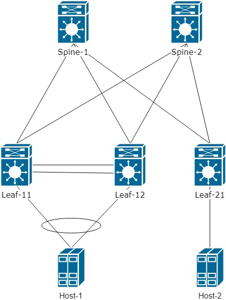
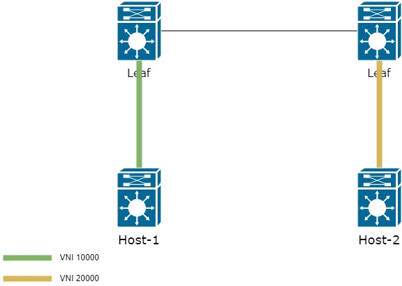
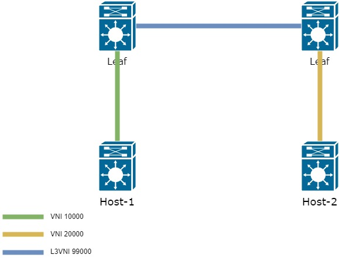
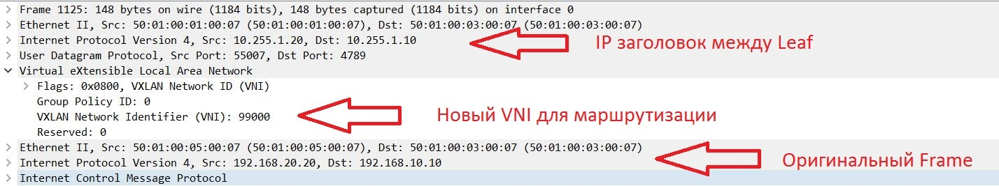
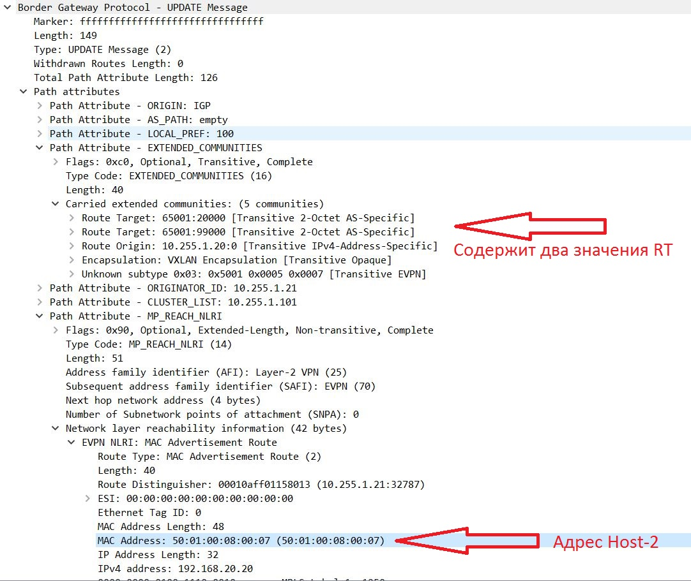
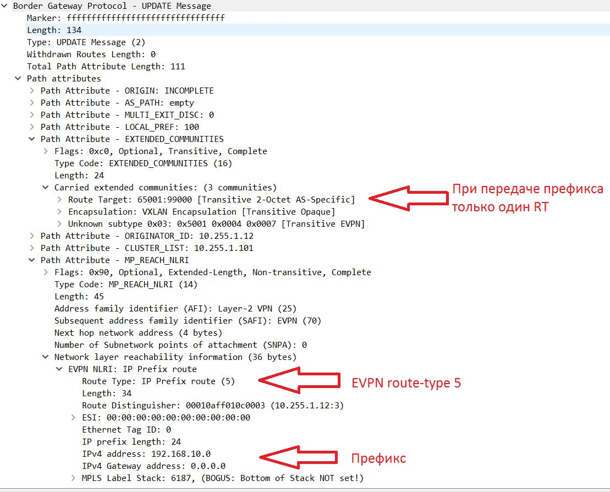

Во второй части цикла статей по технологии VxLAN EVPN рассмотрим маршрутизацию между VNI внутри сетевой фабрики.

Напомню, что используется топология Spine-Leaf:



В прошлой части мы добились одного широковещательного домена, построенного поверх сетевой фабрики на Nexus 9000v.
Однако это далеко не весь спектр задач, которые необходимо решить в рамках сети ЦОД. И сегодня мы рассмотрим следующую 
задачу - маршрутизация между VNI.

Для начала разберем, как просиходит маршрутизация и какие есть особенности.

Для пониамния упростим схему и добавим еще один VNI 20000 для Host-2. В итоге получается:



Как в таком случае можно передать трафик от одного Host к другому?

Есть два варианта:

1. На всех Leaf коммутаторах держать информацию обо всех VNI, тогда вся маршрутизация будет просиходить на первом же Leaf в сети
2. Использовать специально выделенный L3 VNI

Первый способ оставлю для самостоятельной практики, так как никаких сложностей в нем нет. Но будет честны, в работе он применяется довольно редко. 
Сейчас разберем 2 способ, как более интересный и чуть более сложный, но дающий преимущества.

Так же в топологию сразу добавим VRF PROD. В него добавим interface vlan 10 и interface VLAN 20 на Leaf-21. VLAN 20 проаасоциируем с VNI 20000
```buildoutcfg
vrf context PROD
  rd auto                       ! Route Distinguisher на данный не принципиален и можем использвать сформированный автоматически
  address-family ipv4 unicast
    route-target both auto      ! указываем префискы с каким Route-target будут импортироваться и экспортиваться VRF
vlan 20
  vn-segment 20000
  
interface nve 1
  member vni 20000
    ingress-replication protocol bgp
    
interface Vlan10
  no shutdown
  vrf member PROD
  ip address 192.168.20.1/24
  fabric forwarding mode anycast-gateway
```

Для того, чтобы использовать L3VNI  необходимо создать новый VLAN, проассоцировать его с новым VNI. Новый VNI должен быть одинаковым на всех Leaf, 
заинтересованных в информации о VLAN 10 и 20
```buildoutcfg
vlan 99
  vn-segment 99000
  
interface nve1
  member vni 99000 associate-vrf        ! Создаем L3 VNI
  
vrf context PROD
  vni 99000                             ! Привязываем L3 VNI к определенному интерфейсу
```

В результате схема будет представляться так:




Однако, чтобы получить такую схему, необходимо добавить еще один интерфейс - interface vlan 99
```buildoutcfg
interface Vlan99
  no shutdown
  vrf member PROD
  ip forward                            ! На интерфейсе не должно быть IP. Используется только для пересылки пакетов между Leaf
```
В итоге логика прохождения кадра от Host-1 о Host-2 следующая:

1. Кадр, отправленный Host-1 приходит на Leaf в VLAN 10, который проассоциирован с VNI 10000
2. Leaf проверяет где находится адрес назначения и находит его через второй Leaf коммутатор в другом VNI
3. Как только найден маршрут до адреса назначения, Leaf запаковывает кадр в заголовок с необходимым c L3VNI 99000 - и отправляет в сторону второго Leaf
4. Второй Leaf коммутатор получает данные с из L3VNI 99000. Достает изначальный кадр и переносит его в необходимый L2VNI

Результатом такой работы VxLAN убирает необходимость держать на всех Leaf коммутаторах информауиюю обо всех VNI, которые есть в сети. 

В итоге, когда отправляем трафик с Host-1 до Host-2 пакет инкапсулируется внтрь VxLAN с новым VNI - 99000:



Остается понять, как именно Leaf-1 узнает о MAC адресе из другого VNI. Просиходит это с так же с помощью EVPN route-type 2 (MAC/IP).

Ниже показано процесс распространения маршрута о префиксе, находящемся в другом VNI:



То есть адреса полученные из VNI 20000 имеют два RT. 
Напомню, что маршруты полученные из Update попадают в таблицу BGP через Route-target(процесс несколько сложнее, 
однако в рамках данной статьи углубляться в данный процесс не будем).
Сам RT формируется по формуле: AS:VNI(если используется автоматический режим). В результате выше видно, что префиксы из другого VNI имеют два значения RT.
Одно из них 65001:99000 - дополнительный L3 VNI. Так как этот VNI должен быть одинаковым на всех Leaf коммутаторах, префикс попадает в таблицу BGP,
что можно увидеть из вывода команды:

```buildoutcfg
sh bgp l2vpn evpn
<.....>
   Network            Next Hop            Metric     LocPrf     Weight Path
Route Distinguisher: 10.255.1.11:32777    (L2VNI 10000)
*>l[2]:[0]:[0]:[48]:[5001.0007.0007]:[0]:[0.0.0.0]/216
                      10.255.1.10                       100      32768 i
*>l[2]:[0]:[0]:[48]:[5001.0007.0007]:[32]:[192.168.10.10]/272
                      10.255.1.10                       100      32768 i
*>l[3]:[0]:[32]:[10.255.1.10]/88
                      10.255.1.10                       100      32768 i

Route Distinguisher: 10.255.1.21:32787
* i[2]:[0]:[0]:[48]:[5001.0008.0007]:[32]:[192.168.20.20]/272                   ! Префикс полученный из VNI 20000
                      10.255.1.20                       100          0 i
*>i                   10.255.1.20                       100          0 i
``` 

Если посмотрим более внимательно на полученный update, то видно, что данный префикис имеет два RT:
```buildoutcfg
Leaf11# sh bgp l2vpn evpn 5001.0008.0007
BGP routing table information for VRF default, address family L2VPN EVPN
Route Distinguisher: 10.255.1.21:32787
BGP routing table entry for [2]:[0]:[0]:[48]:[5001.0008.0007]:[32]:[192.168.20.2
0]/272, version 5164
Paths: (2 available, best #2)
Flags: (0x000202) (high32 00000000) on xmit-list, is not in l2rib/evpn, is not i
n HW

  Path type: internal, path is valid, not best reason: Neighbor Address, no labeled nexthop
  AS-Path: NONE, path sourced internal to AS
    10.255.1.20 (metric 81) from 10.255.1.102 (10.255.1.102)
      Origin IGP, MED not set, localpref 100, weight 0
      Received label 20000 99000                                                        ! Два label для работы VxLAN
      Extcommunity: RT:65001:20000 RT:65001:99000 SOO:10.255.1.20:0 ENCAP:8             ! Два значения Route-target, на основе, которых добавили данный префикс
          Router MAC:5001.0005.0007
      Originator: 10.255.1.21 Cluster list: 10.255.1.102
<......>
```
 
В таблице маршрутизации на Leaf-1 так же можно наблюдать префикс 192.168.20.20/24:
```buildoutcfg
Leaf11# sh ip route vrf PROD
192.168.10.0/24, ubest/mbest: 1/0, attached
    *via 192.168.10.1, Vlan10, [0/0], 01:29:28, direct
192.168.10.1/32, ubest/mbest: 1/0, attached
    *via 192.168.10.1, Vlan10, [0/0], 01:29:28, local
192.168.10.10/32, ubest/mbest: 1/0, attached
    *via 192.168.10.10, Vlan10, [190/0], 01:27:22, hmm
192.168.20.20/32, ubest/mbest: 1/0                                                  ! Адрес Host-2
    *via 10.255.1.20%default, [200/0], 01:20:20, bgp-65001, internal, tag 65001     ! Доступный через Leaf-2
(evpn) segid: 99000 tunnelid: 0xaff0114 encap: VXLAN                                ! Через VNI 99000
```

Заметили отсутствие основного префикса 192.168.20.0/24 в таблице маршрутизации? Точно, его там просто нет. То есть удаленные Leaf получают информацию только о 
хостах, что есть в вашей сети. И это правильное поведение. Выше во всех update видно, что приходит информация с содержанием MAC/IP (+Route-target).
Ни о каких префисках речи не идет.  

Тут вступает в работу протокол Host Mobility Manager(HMM), который заполяет ARP таблицу из которой дальше заполняется BGP таблица(в рамках данной статьи
опустим этот процесс). На основе информации полученной из HMM формируются EVPN route-type 2 (передается MAC/IP).

Что может пойти не так? Например HMM не отработал. Или появился новый хост, который еще не успел о себе рассказать. Но к нему уже надо отправлять трафик.
В этом случае необходимо передать так же информацию о самом префиксе через EVPN route-type 5 - позволяет передавать префиксы в address-family l2vpn evpn
(данный тип маршрутов на момент написания статьи находится только в draft версии RFС, 
из за этого у рахных вендоров может отличаться принцип работы этого типа маршрута)

Для передачи префсков, небходимо в процессе BGP для VRF прописать добавить какие именно префиксы будут анонсироваться:

```buildoutcfg
router bgp 65001
  vrf PROD
    address-family ipv4 unicast
      redistribute direct route-map VNI20000        ! В данном случае анонсируем префсы подключение непосредственно 
                                                                                            к Leaf в VNI 20000
route-map VNI20000 permit 10
  match ip address prefix-list VNI20000_OUT         ! Указываем какой использовать prefix-list
  
ip prefix-list VNI20000_OUT seq 5 permit 192.168.20.0/24        ! Указываем какие сети будут попадать в EVPN route-type 5
```

В итоге в Update будет:



Посмотрим таблицу BGP:
```buildoutcfg
<......>
   Network            Next Hop            Metric     LocPrf     Weight Path
Route Distinguisher: 10.255.1.11:3
* i[5]:[0]:[0]:[24]:[192.168.10.0]/224
                      10.255.1.10              0        100          0 ?
*>i                   10.255.1.10              0        100          0 ?

Route Distinguisher: 10.255.1.11:32777
* i[2]:[0]:[0]:[48]:[5001.0007.0007]:[0]:[0.0.0.0]/216
                      10.255.1.10                       100          0 i
*>i                   10.255.1.10                       100          0 i
* i[2]:[0]:[0]:[48]:[5001.0007.0007]:[32]:[192.168.10.10]/272
                      10.255.1.10                       100          0 i
*>i                   10.255.1.10                       100          0 i
* i[3]:[0]:[32]:[10.255.1.10]/88
                      10.255.1.10                       100          0 i
*>i                   10.255.1.10                       100          0 i

Route Distinguisher: 10.255.1.12:3
*>i[5]:[0]:[0]:[24]:[192.168.10.0]/224                                      ! EVPN route-type 5 с номером префикса
                      10.255.1.10              0        100          0 ?
* i
<.......>                   
```
В таблице маршртрутизации префикс так же появился:

```buildoutcfg
Leaf21# sh ip ro vrf PROD
192.168.10.0/24, ubest/mbest: 1/0
    *via 10.255.1.10%default, [200/0], 00:14:32, bgp-65001, internal, tag 65001  ! Удаленный префикс, доступный через Leaf1/2(адрес Next-hop = virtual IP между парой VPC)
(evpn) segid: 99000 tunnelid: 0xaff010a encap: VXLAN                             ! Префиск доступен через L3VNI 99000

192.168.10.10/32, ubest/mbest: 1/0
    *via 10.255.1.10%default, [200/0], 02:33:40, bgp-65001, internal, tag 65001
(evpn) segid: 99000 tunnelid: 0xaff010a encap: VXLAN

192.168.20.0/24, ubest/mbest: 1/0, attached
    *via 192.168.20.1, Vlan20, [0/0], 02:39:44, direct
192.168.20.1/32, ubest/mbest: 1/0, attached
    *via 192.168.20.1, Vlan20, [0/0], 02:39:44, local
192.168.20.20/32, ubest/mbest: 1/0, attached
    *via 192.168.20.20, Vlan20, [190/0], 02:35:46, hmm
```
