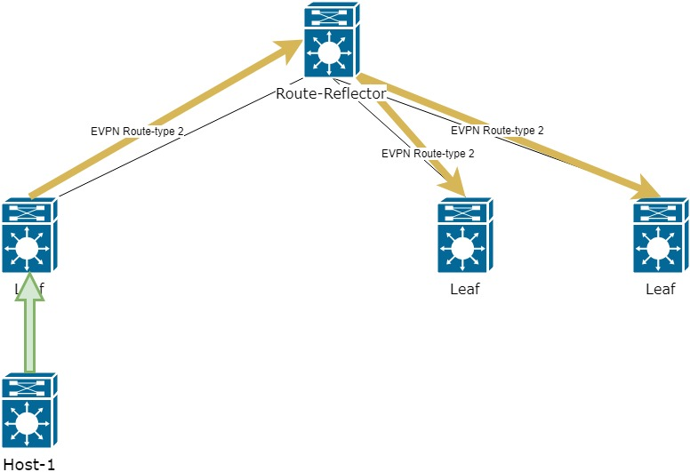
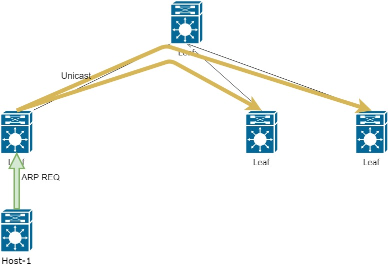
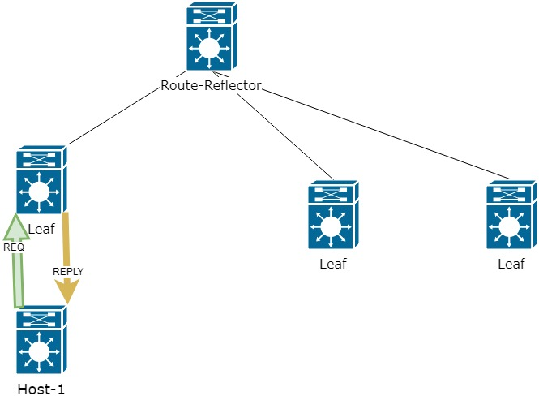
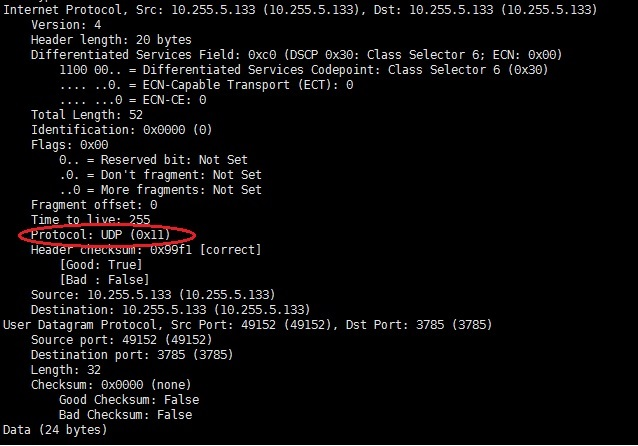

Всем привет. Проходил тут собеседование и появилась мысль следующую часть сделать более теоретической, дабы ответить 
на некоторые вопросы с которыми столкнулся во время интервью.

Многие тут вещи будут скорее базового уровня в понятиях VxLAN и не должны вызывать трудностей.

[1 часть цикла - L2 связанность между серверами](https://habr.com/ru/company/otus/blog/505442/)
[2 часть цикла - маршрутизация](https://habr.com/ru/company/otus/blog/506800/)

 ### I. как VxLAN фабрика узнает о MAC адресах?
 
Да мы уже разобрали, что MAC и IP адреса передаются через EVPN route-type 2. Но как EVPN узнает о них? 
Все довольно просто и работает аналогично логике обычного VLAN:
   * Кадр от источника попадает на порт коммутатора (VTEP) 
   * Коммутатор, если не знает MAC источника - записывает его в свою таблицу TCAM
   * Так как коммутатор выполняет роль VTEP, то информацию о MAC и IP адресах источника он передает через EVPN route-type 2 
(каким именно образом зависит от настройки фабрики. В нашем случае используется Route-reflector(RR), поэтому информация
 отправляется к RR и от него к остальном VTEP)

С источником все понятно. а что делать с Destination? Ведь Host-источник скорее всего не знает MAC адрес назначения и
 пошлет ARP запрос.
Появляется два варианта:
   1. не использовать функцию Suppress-ARP
   2. использовать функцию Suppress-ARP

В первом случае все довольно просто, но не оптимально. При получешении Broadcast запроса VTEP отправит его дальше в рамках того VNI, 
от куда пришел запрос. То есть по всей фабрикик разойдется этот запрос в виде Unicast сообщений.  

Во втором случае, при получении ARP запроса VTEP сам отвечает ARP reply, а ARP REQ дальше не отправляется.

Однако такая логика работает только если VTEP уже знает Destination MAC. Если адрес не извест, то пойдем по первому пути
Более подробно работы и настройки я касался в [первой](https://habr.com/ru/company/otus/blog/505442) части цикла. 

 ### II. Зачем используется UDP?

Вопрос не менее интересный и ответить довольно просто. Для этого вспомним логику работы VxLAN фабрики:
К кадру, прилетающему на порт VTEP, добавляется VxLAN метка с номером VNI. Далее получившийся кадр запоковывается в UDP, 
 инкапсулируется в новый IP пакет и передается поверх Underlay сети. 

Так почему же нельзя оригинальный кадр с меткой VxLAN запаковать в IP и необходимо использовать UDP? 
А все из за одного поля в заголовке протокола IP - Protocol, который указывает, какой именно протокол находится выше. 
Примеры протоколов и их номера ([wiki](https://www.iana.org/assignments/protocol-numbers/protocol-numbers.xhtml)):

    ICMP - 1
    TCP - 6
    UDP - 17
    GRE - 47

И в этом кроется весь секрет - VxLAN не имеет такой номер, а значит протокол IP не сможет о нем рассказать и уважающая себя сеть
такой пакет не пропустит
Поэтому инженеры обошли эту проблему с использоваением протокола UDP.

И тут может возникнуть второй вопрос - почему не TCP? А все потому, что TCP гарантирует доставку и для такой гарантии использует
жутко долгие таймеры, проверки, регулирование полосы пропускания и т.д. В итоге TCP дает большую задержку, которая особенно 
 сильно будет заметна, когда клиент VxLAN фабрики тоже будет использовать TCP.
     
 ### III. Разница между ingress-replication и Multicast
 
Тема довольно объемная и в качестве краткого пояснения ответ дать не получится. Поэтому работа Multicast будет рассмотрена в 
рамках следующей статьи. Однако я попробую дать краткое описание различий двух технологий.
   
Для начала рассмотрим как передаются пакеты в обоих случаях.

ingress-replication: в случае получения широковещательного трафика (например ARP запрос) - запрос
инкапсулируется внутрь VxLAN и передается каждому VTEP в VxLAN через Unicast сообщения (для примера откажемся от RR). 
Так как VTEP будет больше 1, то широковещательный трафик будет "задваиваться".

В случае использования Multicast, каждый VTEP для каждого VNI подписывается на определенную Multicast группу. И теперь, 
при получении широковещательного трафика, VTEP инкапсулирует ARP запрос в IP пакет. В заголовках IP пакета в качестве адреса
назначения используется multicast адрес группы для этого VNI, а адрес источник - IP адрес интерфейса NVE  

Например, VNI 10000 ассоциируем c multicast группой 225.1.10.10

Таким образом у нас пропадает "задваивание" шировещательного трафика. Плюс, при должной оптимизации трафика работа через 
Multicast будет более масшабируема. 
Единственная сложность - underlay сеть должна поддерживать Multicast трафик

Если у вас возникает вопрос - Зачем вообще понадобился EVPN, если все может отлично работать через Multicast, ведь это более 
масштабируемое решение?

Ответ тут дать довольно затруднительно и вам придется решать самостоятельно какую использовать технологию. На данный 
момент, Multicast действительно является более масштабируемым решением. Но EVPN постоянно дорабатывается и в нем появляются
новые route-type для передачи все большей информации о сети для более гибкой настройки. Дополнительно EVPN строится на основе
BGP, а значит есть возможность использовать все методы оптимизации, что и в самом BGP (например в моем стенде уже используется RR,
для уменьшения BUM трафикаю)

Получилась довольно небольшая часть, но думаю она поможет прояснить некоторые моменты в понимании технологии.