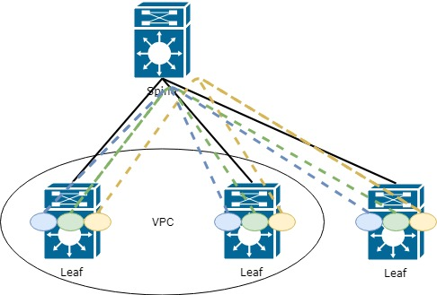

Привет, Хабр. Заканчиваю цикл статей, **посвященных запуску курса ["Сетевой инженер"](https://otus.pw/xh1P1/) от OTUS**,
по технологии VxLAN EVPN по маршрутизации внутри фабрики и и спользовании Firewall для ограничения доступа между внутренними
сервисами


Предыдущие части цикла можно найти по ссылкам:

- [1 часть цикла - L2 связанность между серверами](https://habr.com/ru/company/otus/blog/505442/)
- [2 часть цикла - Маршрутизация между VNI](https://habr.com/ru/company/otus/blog/506800/)
- [2.5 часть цикла - Теоретическоре отступление](https://habr.com/ru/company/otus/blog/518128/)


Сегодня продолжим изучать логику маршрутизация внутри фабрики VxLAN. В предыдущей части мы рассматривали маршрутизацию
внутри фабрики в рамках одного VRF. Однако в сети может быть огромное количество сервисов-клиентов и всех
надо расположиться в различных VRF, для разграничения доступа между ними. Дополнительно к сетевому разграничению, у 
бизнеса может быть потребоность подключить firewall, для ограничения доступа между этими сервисами. Да, нельязя назвать
это лучшим решением, однако современные реалии требуют "современных решений".

Рассмотрим два варинта маршрутизации между VRF:

1. Маршрутизация, не выходя из VxLAN фабрики
2. Маршрутизация на внешнем оборудовании

Начнем с логики маршрутизции между VRF.
Eсть определенное количество VRF. Чтобы маршрутизатировать между VRF, необходимо выделить устройство в сети, 
которое будет знать обо всех VRF (или части, между которыми нужна маршрутизация).
Таким устройством может стать, например, один из Leaf коммутаторов (или все сразу). Выглядеть такая топология
будет следующим образом:



Какие недостатки в такой топологии? Верно, каждый Leaf должен знать обо всех VRF (и всей информации, что есть в них)
в сети, что ведет к потере памяти и повышению нагрузки на сеть. Ведь довольно часто каждому Leaf коммутатору
 не надо знать обо всем, что есть в сети.
 
Однако рассмотрим такой способ подробнее, так как для небольших сетей такой вариант вполне подойдет (если нет каких-либо 
специфичных требований бизнеса на тему Firewall между VRF)

На этом моменте у вас может появится вопрос, как передавать информацию из VRF в VRF, ведь смысл этой технологии как раз в том,
что распространение информции ограничено.

И ответ кроется в таких функциях как export и import маршрутной информции (настройку данной технологии расстатривали во 
[второй](https://habr.com/ru/company/otus/blog/506800/) части цикла). Кратко повторю:

При задании VRF в AF необходимо указать `route-target` для import и export маршрутной информации.
 Указать его можно в автоматическом режиме. Тогда в значение попадет ASN BGP и L3 VNI, привязанный к VRF. 
 Это удобно, когда у вас в фабрике используется только одна ASN:
 
 ```buildoutcfg

vrf context PROD20
  address-family ipv4 unicast
    route-target export auto      ! В автоматическом режиме экспортируется RT-65001:99000
    route-target import auto
```

Однако есть у вас больше ASN и необходимо передавать маршруты между ними, то более удобным и масштабируемым вариантом будет 
ручная настройка `route-target`. Рекомендация в ручной настройке - первое число - использовать удобное Вам, например, `9999`. 
Второе следует сделать равным VNI, для этого VRF настроим следующим образом:

```buildoutcfg

vrf context PROD10
  address-family ipv4 unicast
    route-target export 9999:99000          
    route-target import 9999:99000
    route-target import 9999:77000         ! Пример 1 import из другого VRF
    route-target import 9999:77000         ! Пример 2 import из другого VRF
```

Как выглядит в таблице маршрутизации:

```buildoutcfg
Leaf11# sh ip route vrf prod

<.....>

192.168.20.0/24, ubest/mbest: 1/0
    *via 10.255.1.20%default, [200/0], 00:24:45, bgp-65001, internal, tag 65001
(evpn) segid: 99000 tunnelid: 0xaff0114 encap: VXLAN                        ! префикс доступен через L3VNI 99000
```


Рассмотрим второй вариант маршрутизации между VRF - через внешнее оборудование, например firewall. 

Можно предположить несколько вариантовм работы через внешнее устройство:
1. Устройство знает, что такое VxLAN и мы можем добавить его в часть фабрики
2. Устройство ничего не знает об VxLAN

На первом варианте останавливаться не будем, так как логика будет практически такая же, как показано выше.

Рассмотрим второй вариант, когда наше устройство, пусть будет Firewall, ничего не знает об VxLAN (сейчас, конечно. появляется
оборудование с VxLAN, например, Checkpoint анонсировал его поддержку в версии R81. 
Почитать об этом можно [тут](https://habr.com/ru/company/tssolution/blog/517378/), однако это все на стадии тестирования).

При подключении внешнего устройства у нас получается следущая схема:


Как видно по схеме - появляется узкое местро на стыке с Firewall. Необходимо это учитывать в дальнейшем при планровании сети
и оптимизации сетевого трафика.

Однако, вернемся к изначальной задаче маршрутизации между VRF. В результате добавления Firewall мы приходим к тому, что 
Firewall должен знать обо всех Firewall. Для этого на пограничных Leaf так же должны быть настроены все VRF, а Firewall
подключаем в каждый VRF.

В результате схема работы с Firewall:


То есть на Firewall необходмо настроить интерфейс в каждый VRF, находящийся в сети. В целом логика выглядит не сложно и 
единственное, что может тут не нравится, так это огромное количество на Firewall, и тут уже пора задуматься об автоматизации.

Хорошо. Подключили Firewall, добавили его во все VRF. Но как теперь заставить трафик с каждого Leaf идти через этот Firewall?
На Leaf, подключенному к Firewall, никаких проблем не возникнет, так как все маршруты локальные:

```buildoutcfg

0.0.0.0/0, ubest/mbest: 1/0
    *via 10.254.13.55, [1/0], 6w5d, static       ! Firewall

```

##### Однако как быть с удаленными Leaf? Как передать им внешний маршрут по-умолчанию?
Верно, через EVPN route-type 5, как и любой другой префикс по VxLAN фабрике. Однако с этим не все так просто (если мы
говорим про cisco, как у других вендоров не проверял)

Анансировать маршрут по-умолчанию необходимо с Leaf, к котому подключен Firewall. Однако для передачи маршрута, Leaf 
должен сам его знать. И тут возникает некоторая проблема (возможно только у меня), маршрут необходимо прописать статикой 
в том VRF, где вы хотите анонсировать такой маршрут:

```buildoutcfg
vrf context PROD10
    ip route 0.0.0.0/0 10.254.13.55
```

Далее в настройке BGP задать этот маршрут в AF IPv4:

```buildoutcfg
router bgp 65001
    vrf prod
        address-family ipv4 unicast
            network 0.0.0.0/0
```

Однако это не все. Таки образом маршрут по-умолчанию не попадет в семейство `l2vpn evpn`

Дополнительно к этому необходимо настроить редистрибуцию:

```buildoutcfg
router bgp 65001
    vrf prod
        address-family ipv4 unicast
            network 0.0.0.0/0
            redistribute static route-map COMMON_OUT
```

Указываем какие именно префиксы попадут в BGP через редистрибуцию
```buildoutcfg
route-map COMMON_OUT permit 10
  match ip address prefix-list COMMON_OUT
  
ip prefix-list COMMON_OUT_GATE seq 10 permit 0.0.0.0/0
```


Теперь префикс `0.0.0.0/0` попадает в EVPN route-type 5 и передается остальным Leaf:

```buildoutcfg
0.0.0.0/0, ubest/mbest: 1/0
    *via 10.255.1.5%default, [200/0], 5w6d, bgp-65001, internal, tag 65001, segid: 99000 tunnelid: 0xaff0105 encap: VXLAN
    ! 10.255.1.5 - Виртуальный адрес Leaf(так как Leaf выступают в качестве VPС пары), к которому подключен Firewall
```

В таблице BGP так же можем наблюдать полученный route-type 5 с дефолтным маршрутом через 10.255.1.5:

```buildoutcfg
* i[5]:[0]:[0]:[0]:[0.0.0.0]/224
                      10.255.1.5                        100          0 i
*>i                   10.255.1.5                        100          0 i

```


На этом закончим цикл статей посвященных EVPN. В дальнейшем постараюсь рассмотреть работу VxLAN в связке с Multicast, 
так как такой способ считается более масштабируемым (на данный момент спорное утверждение)

Если же у вас остались вопросы/предложения на тему, рассмотреть какой-либо фунционал EVPN - напишите, рассмотрим дополнительно
