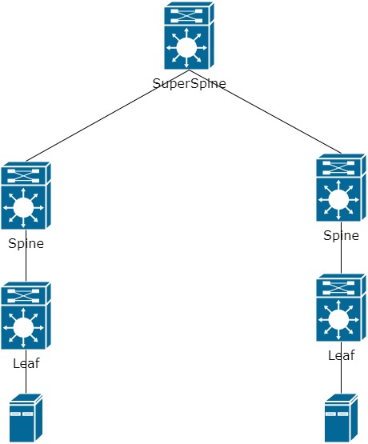
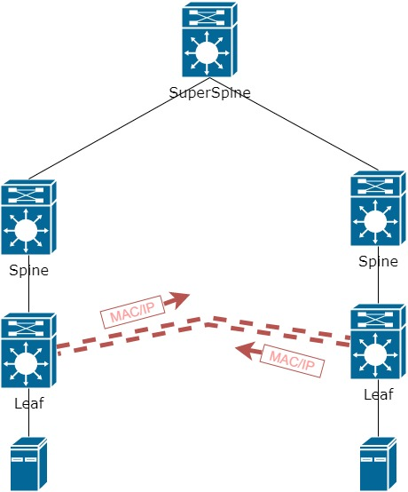
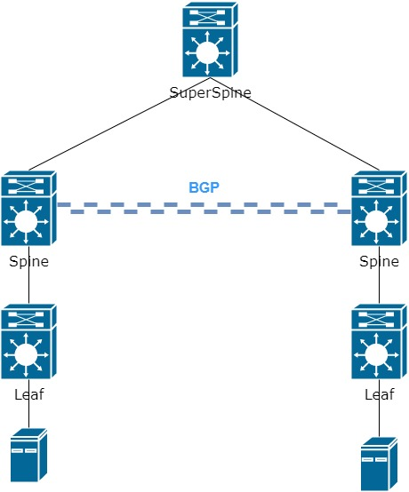
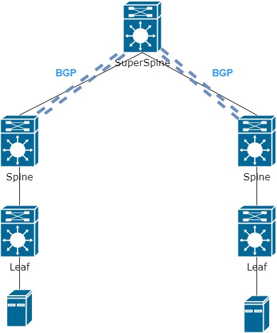
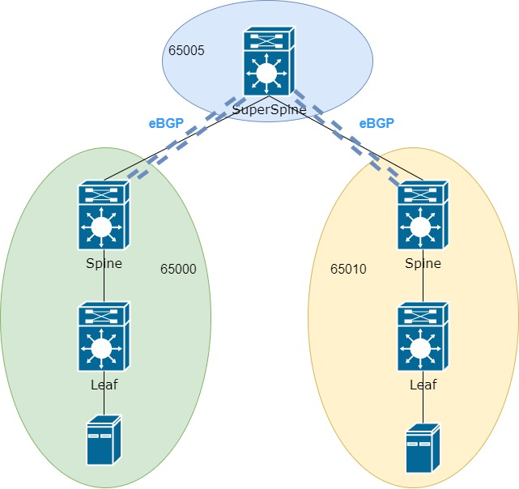
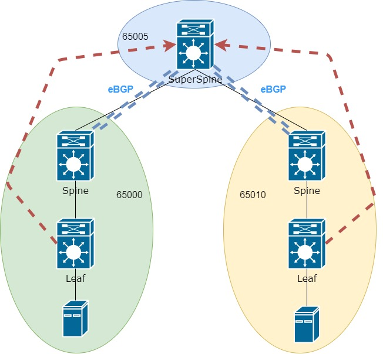

Привет, Хабр! Все еще заканчиваю цикл статей, , **посвященных запуску курса
 ["Архитектор сетей"](https://otus.ru/lessons/archit_nets/) от OTUS**, по технологии VxLAN EVPN. 
 И сегодня обсудим реализацию подключений нескольких ЦОД в одну VxLAN фабрику


1
<cut/>

Предыдущие части цикла можно найти по ссылкам:

- [1 часть цикла - L2 связанность между серверами](https://habr.com/ru/company/otus/blog/505442/)
- [2 часть цикла - Маршрутизация между VNI](https://habr.com/ru/company/otus/blog/506800/)
- [2.5 часть цикла - Теоретическое отступление](https://habr.com/ru/company/otus/blog/518128/)
- [3 часть цикла - Подключение внешнего маршрутизатора/firewall](https://habr.com/ru/company/otus/blog/519256/)


Для начала определимся какие варианты подключения сущесвуют:

1. Multipod
2. Multisite

Да, вариантов не так много, однако их достаточно для решения поставленной задачи. 
Разберемся подробнее в каждом из способов. К уже знакомой ранее схеме, добавим второе подключение(второй ЦОД или второй машинный зал),
в результате чего мы не можем подключить Leaf к уже существующему Spine. Возможно расстояние слишком большое или не хватка портов. Для простоты схемы я оставлю по одну Spine и одному Leaf коммутатору.
В итоге добавляем еще один уровен в underlay сети - SuperSpine(SS):

 

Далее нам надо построить связанность между конечными узлами. И тут довольно много вариантов развития событий. Для начала предположим
что с одной стороны у нас есть VNI 10000 и IP адрес устройства находится в сети 10.0.0.0/24 и с другой стороны так же 
необходимо использовать сеть 10.0.0.0/24, предоставив один L2 домен между различными машинными залами или ЦОД.

В резульатате такой работы Leaf'ам необходимо поднять тоннель по которому Leaf будут обмениваться информацией о MAC и IP адресах:



Хорошо. С основной задачей определились. Остается понять как же построить тоннель между Leaf. А точнее как именно Leaf узнают друг о друге. 
Как мы помним из [предыдущих](https://habr.com/ru/company/otus/blog/505442/) статей Leaf регистрируются в сети с помощью EVPN route-type 3.

Появляется два способа передать информации EVPN:

1. Поднять BGP сессию между Spine:
    
2. Поднять BGP сессию между Spine и SS
    
   
И снова есть два варианта настройки BGP сессии. C Обеих сторон мы можем использовать одну и туже AS, тогда VNI будут иметь вид
65000:10000, где 65000 номер AS, 10000 - номер VNI (номера взяты из прошлых частей).

При одной AS проблем в целом не возникнет. Но при увелечении сети управлять одной AS может быть проблематично. Так как в iBGP 
требуется Full-Mesh, либо настройка Route-reflector. 

Исходя из всего этого мы будет настраивать каждую часть независимо друг от друга. То есть левый Spine находится в AS 65000. Правый 
Spine в AS 65010.
Остается вопрос что делать с SS. Исходя из первого варианта SS можно использовать чисто как Underlay сеть. В целом вариант рабочий,
Но только до тех пор пока в вашей сети не появится 3,4,5 и более подключенных к нему Spine. Так как между Spine придется поднимать Full-Mesh,
для передачи маршрутной информации.

Второй вариант кажется более удобным - поднимать BGP сесиию на SS с каждым Spine. Тогда не требуется Full-Mesh между отдельными Spine, что удобно
в плане настройки и управления, но приводит к единой точке отказа(не забывайте, что каждое устройство должно дубрироваться).

Так как мы ранее отнесли все к разным AS, то к какой же отнести SS? Все просто - SS имеет свою AS:



Теперь у нас появился eBGP пиринг и такое отношение может привести к некоторой проблеме...

Для начала вспомним как именно Leaf строят тоннели между собой. Довольно просто. У Leaf есть информация где находится MAC и Next-hop(NH) - то есть как добраться до удаленного MAC. 
Тоннель строится до Next-Hop. 


Например, есть следущая запись в таблице BGP о MAC адресе `00c1.6487.dbd1` , который доступен через NH 10.255.0.3
```
*> i[2]:[0]:[0]:[48]:[00c1.6487.dbd1]:[0]:[0.0.0.0]/216 *>i 10.255.0.3 100 0 64600 i

```
Значит и VxLAN тоннель будет строится до этого же адреса. 
Но в сети появилась eBGP сессия, в которой адрес Next-Hop менятся при покидании локальной AS. Поэтому нам потребуется дополнительная настройка на Spine и SS, 
которая будет запрещать смену NH адреса.

Однако если мы говорим про Nexus, то данная настройка не так очевидна, как хотелось бы...

Для начала потребуется создаться route-map, который запрещает смену NH:

```
route-map NH_UNCHANGED
 set ip next-hop unchanged
```
Далее устанавливает route-map в сторону eBGP соседей:
```
router bgp 65000
  neighbor 10.255.0.1 - адрес SS
  address-familly l2vpn evpn
    route-map NH_UNCHANGED out
```

Как вы могли заметить route-map устанавливается в адрессном семействе l2vpn evpn и вы верно подумали. SS так же должен понимать это адресное семейство, чтобы передавать информацию EVPN

Хорошо на этом можно считать, что задача выполнена, но как только мы начинаем проверять, что вся информация о MAC и IP доходит до leaf - понимаем, что
до них она так и не дошла, а застряла на SS



То есть информация вся информация долшла до SS, но он ее не отправляет дальше. Все дело в том, что тут работает обычная логика BGP и все эти маршруты не проходят 
проверку на Next-Hop, так как SS ничего не знает о том как добраться до Leaf(мы ведь запустили только BGP в адресном семействе l2vpn evpn). Чтобы поправить эту ситуации - 
запускаем OSPF между Spine и SS. То есть теперь вся сеть является единым IGP доменом. SS узнал обо всех NH и спокойно передал информацию дальше.

Теперь радостно мы проверяем что все EVPN route-type 2 и 3 и 5 дошли до Leaf, но скорее всего нас снова постигнет разочарование. В таблице маршрутизации мы ничего не знаем о VNI от удаленного Leaf.

Так как ранее мы использовали настройку:

```
evpn
  vni 10000 l2
    route-target import auto   
    route-target export auto
```

Route-target формируется автоматически на основе номер AS и VNI. В результате RT для левой стороны равен 65000:10000. Для правой 65010:10000
Так как правила import работают так же в автоматическом режиме - коммутатора не добавит такой маршрут в таблицу маршрутизации. RT ведь не совпадает с настроенным

Тут можно пустить следующим образом. Вместо автоматического режима настроить RT вручную 
```
evpn
  vni 10000 l2
    route-target import 999:10000   
    route-target export 999:10000
```
То же самое касается и l3 VNI:
```
vrf context PROD
  address-family ipv4 unicast
    route-target both 999:99999 
```

В результе на всех Leaf коммутаторах используется одинаковый RT, по которому маршрут будет добавлен в таблицу маршрутизации и повится связанность между конечными устройствами