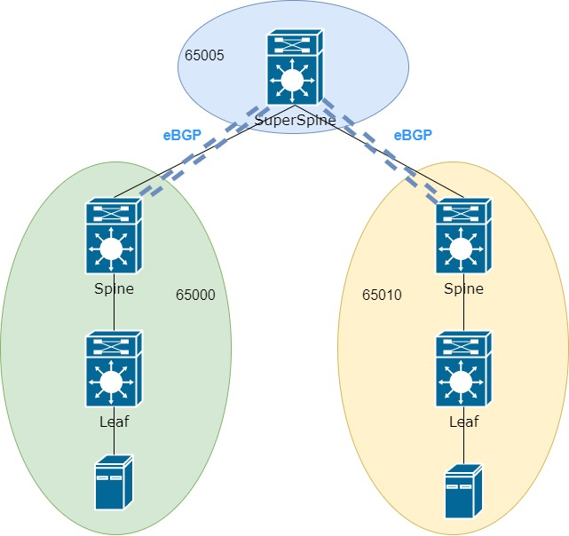
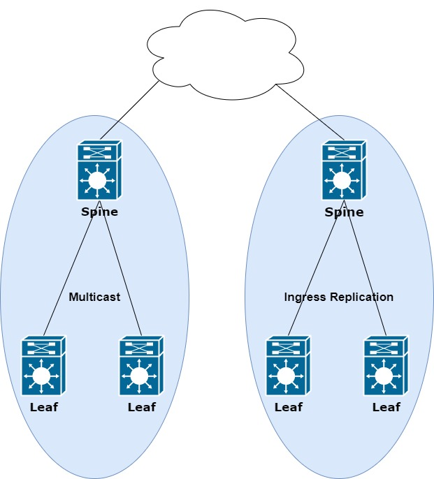
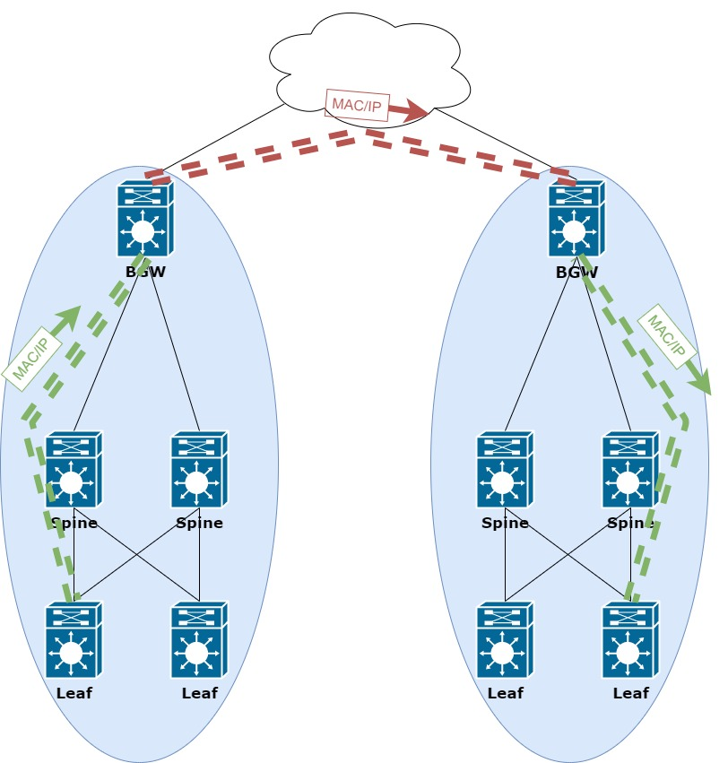
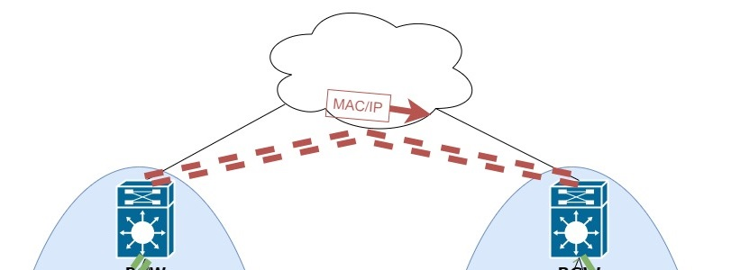

____
<cut/>

Предыдущие части цикла можно найти по ссылкам:

- [1 часть цикла - L2 связанность между серверами](https://habr.com/ru/company/otus/blog/505442/)
- [2 часть цикла - Маршрутизация между VNI](https://habr.com/ru/company/otus/blog/506800/)
- [2.5 часть цикла - Теоретическое отступление](https://habr.com/ru/company/otus/blog/518128/)
- [3 часть цикла - Подключение внешнего маршрутизатора/firewall](https://habr.com/ru/company/otus/blog/519256/)
- [4 часть цикла - Multipod](https://habr.com/ru/company/otus/blog/526628/)

Сегодня рассмотрим второй способ подключение различных ЦОД - Multisite.

Для начала вспомним как строится Underlay при построении фабрики с помощью Multipod. И снова получаем
несколько вариантов построения такой сети. То есть:
1. Underlay сеть может быть единой и, например, использовать OSPF для IP связанности между всеми устройствами в фабрике.
2. Underlay повторяет логику BGP для настройки EVPN и каждый POD находится в своей AS, как показано на рисунке ниже



Однако, вспоминаяю предыдущую часть, приходим к тому, что во всех случаях возникают свои проблемы.
Так в 1 случае, при едином OSPF процессе, может появиться слишком большое количество устройств, например до 100 устройств вряд ли вы встретите какие-либо проблемы, 
и динамическая маршрутизация станет работать заметно медленнее и больше нагружать сетевые устройства.
Во 2-м случае возникает еще больше проблем (ниже указаны не все проблемы, а только основные):
1. Смена Next-Hop. С использованием eBGP, при выходе update из AS, Next-hop меняется. То есть не забываем делать соответствующие настройки
2. Общая проблема для обоих случаев - значение Route-target в автоматическом режиме работать не будет. То есть необходимо использовать статическую настройку, однако это решается автоматизацией таких настроек и сети в целом.
3. С увелечением  количества клиентов, увлечивается и количество MAC/IP адрессов и Broadcast трафик соответственно.

Исходя из перечисленных выше недостатков приходим к тому, что необходимо сегментировать сеть и реализуем это через технологию Multisite.

Для начала обсудим какие преумещества дает сегментация сети.

1. Уменьшение домена рассылки Broadcast для поиска какого-либо клиента сети;
2. Упрощается объединение различных подов через сеть интернет;
3. Проблемы в одном поде никак не влияют на другой сайт;
3. Так как теперь каждый под независим от другого, то возможно использовать на одном сайте ingress replication, а на другом Multicast. То есть ЦОДы с различными технологиями объединяются без каких-либо проблем миграции.



Осталось разобраться как работает данная технология. Для начала разберем теоретическую часть.

При реализации Multisite в сети появляется еще одна роль устройства - BGW(Border Gateway), которая может быть присвоена Spine, а может стать отдельным устройством в сети.
В логической схеме дополнительное устройство встраивается выше Spine, как показано на рисунке ниже:


Но на самом деле, поставить BGW возможно в любое место в сети, главное обеспечить IP связанность?

Осталось разобраться как же это все работает. Однако, для начала вернемся к предыдущим частям и вспомним как все работает в рамках одного POD. 
В одном POD тоннель устанавливается напрямую между VTEP, как показано ниже и LEAF коммутатороы напрямую обмениваются информацией о MAC/IP адресах.


То есть каждый LEAF должен знать о всех VTEP находящихся в его сети.

Теперь, когда вспомнили как работает сеть в рамках одно пода или нескольих, можем перейти к рассмотру логики Multisite.
Для начала приведу общую схему с логикой работы сети. Обяъеснениие происходящего приведу ниже.



Получается что в Multisite тоннель от Leaf строится до BGW, далее BGW строит совершенно другой тоннель до второго BGW, находящего на другом сайте,
и далее строится еще один тоннель уже в рамках другого сайта. Именно такая логика работы, когда между сайтами строится отдельный 
тоннель, позволяет сегментировать сеть у упростить поиск и устранение неисправностей, так как удаленный сайт полностью скрывается за 1 устройством(на самом деле 
рекомендуется использовать как минимум 2 BGW для каждого сайта для отказоустройчивости). 

Далее перейдем к настройке BGW, так как все остальные устройства не меняют свою настройку и никакие изменения на них не совершаются.

Для начала на BGW необходимо включить следующие feature:

```buildoutcfg
feature ospf - для организации Underlay в своем сайте
```
Настройку самой Underlay сети в данном разделе рассматривать не будет. Настройка ничем не отличается от обычной настройки POD. При этом для IP связанности так же можно использовать
IP unnumbered или адреса на point-to-point линках с маской /30 или /31.

После настройки Uderlay сети на BGW необходимо указать интерфейс, который смотрит в локальный сайт:

```buildoutcfg
Interface Ethernet1/50
description SITE-INTERNAL
evpn multisite fabric-tracking - указываем где находится локальный сайт
```

Далее готовим настройки для Overlay сети. Выглядят они практически аналогично настройкам на Leaf коммутаторах. В целом это логично, так как BGW так же имеет роль VTEP.

```buildoutcfg
feature bgp
feature nv overlay
nv overlay evpn
```

После включения необходимых фич, определяем коммуторатов как BGW и привязываем его к номеру сайта. Каждый BGW в одном сайте должен иметь одинаковый идентификатор.

```buildoutcfg
evpn multisite border-gateway <site-id> номер сайта одинаковый у всех BGW в одном сайте
```

Продолжаем настройку BGW и создаем интерфейс NVE

```buildoutcfg
interface nve1
  host-reachability protocol bgp
  source-interface loopback1 - как и на LEAF, интерфейс используется для построения тоннеля в рамках своего сайта
  multisite border-gateway interface loopback100 - новая настройка, используется для построения тоннеля между сайтами
```

Если у вас есть несколько BGW(а их должно быть хотя бы 2), то loopback100 должен иметь одинаковый адрес на всех устройствах с этой ролью - anycast адрес для сайта

Далее настраиваем протокол BGP для работы в локальном сайте. Настройка ничем не отличается от настройки на других устройствах в сетевой фабрики:
```buildoutcfg
router bgp 65501
  neighbor 10.100.100.201
    remote-as 65501
    update-source loopback0
    address-family l2vpn evpn
      send-community
      send-community extended
   neighbor 10.100.100.202
    remote-as 65501
    update-source loopback0
    address-family l2vpn evpn
      send-community
      send-community extended
```

На данном этапе мы произвели настройки необходимы для первого тоннеля между LEAF и BGW


Переходим ко второй части настройки - тоннель между сайтами. Сразу уточню, что этот тоннель всегда должен работать
только с ingress replication.

```buildoutcfg
interface Ethernet1/1
  evpn multisite dci-tracking - команда указания, что интерфейс является внешним локального сайта и смотрит в сторону второго сайта
```

Последнее, что осталось настроить - BGP соседство со вторым сайтом:
```buildoutcfg
router bgp 65501
  neighbor 10.52.52.52 - удаленный сосед
    remote-as 65036
    update-source loopback0 - устанавлиаем так же с loopback
    ebgp-multihop 5
    peer-type fabric-external - указываем, что удаленный пир, относится к фабрике в другом сайте
    address-family l2vpn evpn
      send-community
      send-community extended
      rewrite-evpn-rt-asn - Так как можем использоваться автоматическая настройки RT, то его необходимо изменить на новое значение
```
Намоню, что RT - это route-target и в автоматическом режиме формируется из двух значений AS:VNI

Аналогично необходимо завести всех остальных соседей в других сайтах. При это необходимо потребуется
настроить Full-Mesh между всеми маршрутизатора BGW во всех сайтах. Либо возможно использовать Route-reflector в eBGP

Настроить RR Возможно следующим образом:

```buildoutcfg
router bgp 65036
  address-family l2vpn evpn
    retain route-target all - принимаем все анонсы с любом RT
  template peer OVERLAY-PEERING
    update-source loopback0
    ebgp-multihop 5
    address-family l2vpn evpn
      send-community both
      route-map UNCHANGED out - запрещаем менять значение атрибута Next-Hop

 neighbor 10.100.100.21 remote-as 65501
    inherit peer OVERLAY-PEERING
    address-family l2vpn evpn
      rewrite-evpn-rt-asn - так же переписываем значение RT, при автоматическом режиме формировния

route-map UNCHANGED permit 10 - route-map в котором указываем запрет смены NH
  set ip next-hop unchanged 
```



На этом настройка Multisite закончена. Единственное на данный момент неполучается реализовать mulisite в виртуальной среде. На железе все запускается 
без особых проблем. Возможно в новых виртуальных образах ситуация исправлена.

Подробнее про работут технологии можно посмотреть в [RFC-7432](https://tools.ietf.org/html/rfc7432)
и в [draft-ietf-bess-evpn-overlay](https://tools.ietf.org/html/draft-ietf-bess-evpn-overlay), [draft-ietf-bess-evpn-prefix-advertisement](https://tools.ietf.org/html/draft-ietf-bess-evpn-prefix-advertisement-11), [draft-ietf-bess-evpn-inter-subnet-forwarding](https://tools.ietf.org/html/draft-ietf-bess-evpn-inter-subnet-forwarding-13)