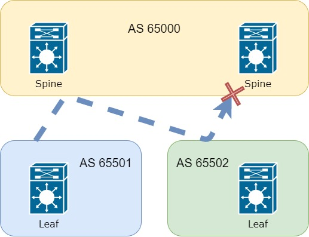
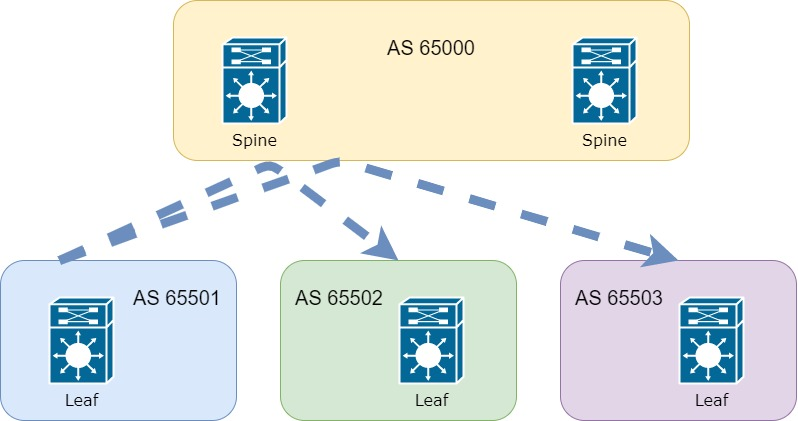

<cut/>

Предыдущие части цикла можно найти по ссылкам:

- [1 часть цикла - L2 связанность между серверами](https://habr.com/ru/company/otus/blog/505442/)
- [2 часть цикла - Маршрутизация между VNI](https://habr.com/ru/company/otus/blog/506800/)
- [2.5 часть цикла - Теоретическое отступление](https://habr.com/ru/company/otus/blog/518128/)
- [3 часть цикла - Подключение внешнего маршрутизатора/firewall](https://habr.com/ru/company/otus/blog/519256/)
- [4 часть цикла - Multipod](https://habr.com/ru/company/otus/blog/526628/)
- [5 часть цикла - Multisite](https://habr.com/ru/company/otus/blog/551854/)


До этого момента тема eBGP в overlay практически не затрагивалась, за исключением Multipod топологии,
однако, и там все было довольно поверхностно и не хватает деталей для полной реализации в одном поде.
Так что исправим это допущение и рассмотрим поближе eBGP.

Для начала предлагаю определиться для чего использовать eBGP и для чего iBGP(тут чисто субъективный взгляд. Ваше мнение 
может сильно отличаться от мнения автора):
 - iBGP - удобно использовать, когда в underlay сети настрон протокол семейства IGP, например, OSPF или IS-IS.
 В этом случае нет смысла усложнять топологию различными AS в BGP и вполне логично использовать только iBGP.
 - eBGP - используется, когда в underlay так же настроен BGP. При этом довольна частая ситуация, что сеть underlay 
 разделяют на различные AS(возможно в данном случае удобно делать фильтры по AS-path). Тогда ничего не остается и приходится 
 использовать eBGP еще и в Overlay(большая редкость, когда устройства позволяют запустить несколько процессов BGP с разным номер AS)

Перейдем непосредственно к сравнению различных реолизаций протокола. Сеть underlay у нас остается неизменна и представлена ниже:


При использовании eBGP в underlay, сеть принято разделять на зоны следующим образом:
 1. Spine находятся в одной автономной системе. Будем использовать AS 65000
 2. Каждый Leaf находятся в своей автономной системе. Нумерается начинается с 65500 и далее 

Такой подход позволяет избежать петель в сети, так как update пришедший от одного Spine к другому Spine будет отброшен из 
за однакого номера AS:



При этом Leaf находятся в разных AS и все update от одного Leaf спокойно дойдут до всех остальных:



Таким образом underlay сеть может работать стабильно без дополнительных конфигураций и добавление роли Route-reflector в сеть.
Но такая простота в одном месте, способна усложить жизнь в другом.
Для начала рассмотрим конфигурации iBGP:

Spine:

```

feature bgp
nv overlay evpn
router bgp 65001
  template peer LEAF 
    remote-as 65001
    update-source loopback0
    address-family l2vpn evpn
      send-community
      send-community extended
      route-reflector-client
  neighbor 10.255.1.11
    inherit peer LEAF
  neighbor 10.255.1.12
    inherit peer LEAF
  neighbor 10.255.1.21
    inherit peer LEAF

```
и на Leaf:

```
feature bgp
nv overlay evpn
router bgp 65001
  template peer SPINE
    remote-as 65001
    update-source loopback0
    address-family l2vpn evpn
      send-community
      send-community extended
  neighbor 10.255.1.101
    inherit peer SPINE
  neighbor 10.255.1.102
    inherit peer SPINE
```

В целом все выглядит довольно просто и никаких сложностей тут не должно возникнуть.
Далее расмотрим конфигурации  `route-targer` на Leaf коммутаторе для L2VNI, который используется при передаче update по overlay сети и позволяет отдельным VTEP 
добавлять только определенные update, а не все в сети.

```
evpn
  vni 10000 l2
    route-target import auto 
    route-target export auto
``` 

Как видно все довольно просто и не требует каких-либо сложностей и дополнительных вопросов.

Думаю с iBGP разобрались, все таки большая часть цикла посвященна именно данной задаче и пора бы приступить к рассмотрению eBGP.

Для начала рассмотрим найстройку BGP Spine:

```
feature bgp
nv overlay evpn
router bgp 65000
  template peer LEAF 
    address-family l2vpn evpn
      send-community
      send-community extended
  neighbor 10.255.1.11
    remote-as 65501
    inherit peer LEAF
  neighbor 10.255.1.12
    remote-as 65502
    inherit peer LEAF
  neighbor 10.255.1.21
    remote-as 65503
    inherit peer LEAF
```

и Leaf 
```
feature bgp
nv overlay evpn
router bgp 65501
  template peer SPINE
    address-family l2vpn evpn
      send-community
      send-community extended
  neighbor 10.255.1.101
    remote-as 65000
    inherit peer SPINE
  neighbor 10.255.1.102
    remote-as 65000
    inherit peer SPINE
 ```

В целом настройка особо не отличается от iBGP, за исключением номеров AS и удаление Route-reflector. Однако попробуйте остановиться 
и подумать что может пойти не так, если мы оставим настройку в таком сосотоянии.

А пойти не так может следуюещее:
Первая проблема - в отличии от iBGP в eBGP меняется Next-hop при переходе из одной AS в другую, то есть Leaf в AS 65502 увидит не NH Leaf в 65501, 
а адрес Spine из AS 65000 и попытается построить VxLAN до этого NH. Вполне логично, что это не заработает
    1. На Spine нет того клиента к которому обращается Leaf
    2. Spine не имеет включенных фич для работы с VxLAN и не может выступать в роли VTEP 
    
Такая задача решается принудительным запретов Spine менять адрес Next-hop в сторону leaf коммутаторов. Необходимо создать route-map в котором будет следующая настройк:
```
route-map UNCHANCHED_NH permit 10
    set ip next-hop unchanged  
```    
Далее применяем это все к соседям Leaf:
```
template peer LEAF 
    route-map UNCHANCHED_NH out
```
После применения команда Spine перестанет менять NH. Дополнительно замечу, что на Cisco Nexus не предусмотрена отдельная команда
для запрета смены NH. Этот вопрос можно решить только с помощью route-map. Что в свою очередь дает возможность применять команду только к отдельным update(например использовать различныее ACL для выбора определенного update)

Вторая проблема на первый взгляд не такая явная и связана она с route-target и будет основным не удобством eBGP в Overlay. Тут появялется сразу два неудобства:

Первое неочевидное неудобство заключается в невозможности использовать параметр `auto`, так как в этом случае route-target берет значения AS:VNI, в eBGP же AS всегда
будет разный, а значит route-target не совпадет между разными Leaf. Решается проблема довольно просто - задание данной настройки вручную:
```
evpn
  vni 10000 l2
    route-target import 9999:10000 
    route-target export 9999:10000
``` 
под каждый VNI необходимо задавать свои настройки и соблюдать идентичность RT между VTEP. Это задача довольно просто решается автоматизацией настройки VTEP,
вручную вполне можно запутаться. Можно сказать, что тут наступает момент когда сетевику надо пойти в автоматизацию.

Второе неочевидное неудобство, как ни странно, находится на Spine. Все дело в том что Spine тоже смотрит в поле RT и если значение пришло не внутренней AS - 
update отбросится. Тут придется немного схитрить и добавить команды:
```
router bgp 65000
    address-family l2vpn evpn
      retain route-target all
```

Подведем некий итог.
Если посмотрим более внимательно на логику работы Spine, то получается он берет на себя некую роль Route-reflector и просто пересылает 
update без какой-либо обработки. То есть
 * Не меняется NH, как при использовании RR.
 * На Spine принимаются абсолютно все update, даже если устройство не знает путь до хоста назначения, и передается на Leaf, что нарушет логику выбора лучшенго маршрута BGP(маршрут должен быть валидным. При неопределнном route-target, маршрут никогда таковым не станет)
 
На Leaf же настройки особо не меняются, за исключением ручной записи RT, что, опять же, решает автоматизацией такой задачи.

В результате, выбирая между iBGP и eBGP в unerlay, нет точного решения что использовать. Однакл я в своих проектах придерживаюсь логики:
1. iBGP, если в underlay работает протокол IGP
2. eBGP, если в underlay работает eBGP.

И тут наверняка могут возникнуть споры по поводу больших сетей и, что протоколы IGP не смогут обеспечить необходимую скорость сходимости сети. Тут отвечу просто - сегментируйте сеть. Используйте Multisite и делайте не зависимые поды.

И, конечно же, не используйте Overlay. Используйте маршрутизацию.  