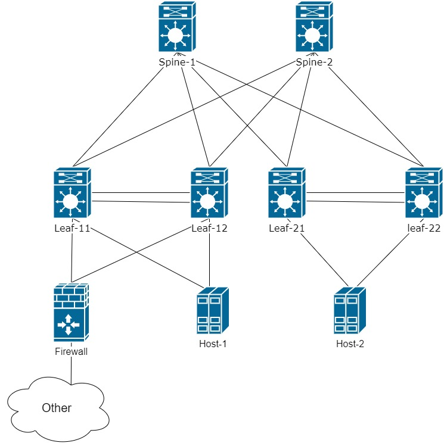

В Этой заметке хочу рассмотреть построение сетевой фабрики на основе VxLAN EVPN с внешним Firewall.
Все примеры будем выполнять на Cisco Nexus9k

Определим основную задачу сети:

1. Организовать L2 доступ между хостами 
2. Организовать маршрутизацию между сетями в рамках одного сервиса. 1 VRF - 1 сервис
3. Подключение Firewall для настройки правил между сервисами. Дополнительно firewall должен работать в качестве шлюза по умолчанию


Все примеры будем выполнять на образах nexus9k

Для решение задачи выбрали топологию Spine-Leaf:



По схеме видно, что для примера есть два хоста и сам firewall с которыми мы и будем проводить эксперименты.

Зададим адресацию:
```buildoutcfg
Spine-1 - 10.255.1.101
Spine-2 - 10.255.1.102

Leaf-11 - 10.255.1.11
Leaf-12 - 10.255.1.12
Leaf-21 - 10.255.1.21
Leaf-22 - 10.255.1.22
```

Для начала необходимо настроить underlay сеть и обеспечить базовую IP связанность между всеми устройствами внутри VxLAN фабрики

### Undrelay

Организуем IP связанность между соседними устройствами:
  ```buildoutcfg
interface loopback0
  description ROUTE_INT
  ip address 10.255.1.11      ! IP можем использовать с /32
  ```

```buildoutcfg
interface ethernet1/1
  no switchport
  mtu 9216
  medium p2p     ! Настраиваем Point-to-Point линки, чтобы убрать необходимость поиска DR/BDR между Nexus
  ip unnumbered loopback0    ! для экономии и упрощения работы заимствуем IP с Loopback
  no shutdown
```

Не будем усложнять сеть и настроим на Leaf и Spine протокол OSPF для IP связанности. 

На Nexus необходимо включить feature OSPF и создать процесс OSPF:
```buildoutcfg
feature ospf

router ospf UNREFLAY
  router-id {ID} ! для каждого устройства задаем ID для упрощения дальнейшего TrobleShoting`a
```
Далее на каждом интерфейсе включаем процесс OSPF. Все устройства 
поместим в area 0:
```buildoutcfg
interface loopback0
  ip router ospf UNDERLAY area 0.0.0.0

interface ethernet1/1-2
  ip router ospf UNDERLAY area 0.0.0.0
```
Проверим, что у нас появилась базоавая IP связанность:

```buildoutcfg
Leaf22# sh ip route
IP Route Table for VRF "default"
'*' denotes best ucast next-hop
'**' denotes best mcast next-hop
'[x/y]' denotes [preference/metric]
'%<string>' in via output denotes VRF <string>

10.255.1.11/32, ubest/mbest: 2/0
    *via 10.255.1.101, Eth1/4, [110/81], 00:00:03, ospf-UNDERLAY, intra
    *via 10.255.1.102, Eth1/3, [110/81], 00:00:03, ospf-UNDERLAY, intra
10.255.1.12/32, ubest/mbest: 2/0
    *via 10.255.1.101, Eth1/4, [110/81], 00:00:03, ospf-UNDERLAY, intra
    *via 10.255.1.102, Eth1/3, [110/81], 00:00:03, ospf-UNDERLAY, intra
10.255.1.21/32, ubest/mbest: 2/0
    *via 10.255.1.101, Eth1/4, [110/81], 00:00:03, ospf-UNDERLAY, intra
    *via 10.255.1.102, Eth1/3, [110/81], 00:00:03, ospf-UNDERLAY, intra
10.255.1.22/32, ubest/mbest: 2/0, attached
    *via 10.255.1.22, Lo0, [0/0], 00:02:20, local
    *via 10.255.1.22, Lo0, [0/0], 00:02:20, direct
10.255.1.101/32, ubest/mbest: 1/0
    *via 10.255.1.101, Eth1/4, [110/41], 00:00:06, ospf-UNDERLAY, intra
10.255.1.102/32, ubest/mbest: 1/0
    *via 10.255.1.102, Eth1/3, [110/41], 00:00:03, ospf-UNDERLAY, intra
```
Как видим от Leaf до других Leaf коммутаторов у нас есть по два пути через 2 Spine.

Так же нам потребуется подключить Firewall. Для этого необходимо включить две фичи:
```buildoutcfg
feature vpc
feature lacp
```
Далее настроим домаен VPC между парами Leaf коммутаторов. Домен VPC должен быть одинаковым на обоих устройстваз в паре Nexus. На данном этапе
настроим только базовые настройки, дальнейшие нюансы связанные с работой VxLAN будем добавлять по мере настройки фабрики:

```buildoutcfg
vpc domain 2
  peer-keepalive destination 192.168.2.1 source 192.168.2.2 ! данные адреса настроены на интерфейсе mgmt
!
! создаем channel-group 7 mode active на интерфейсах между Nexus
!
interface port-channel7 
  vpc peer-link ! указываем, что этот port-channel является служебным линком между парой устройств 
```
Проверим, что VPC синхронизировался и все ок:
```buildoutcfg
vPC domain id                     : 1
Peer status                       : peer adjacency formed ok
vPC keep-alive status             : peer is alive
Configuration consistency status  : success
Per-vlan consistency status       : success
Type-2 consistency status         : success
vPC role                          : primary
Number of vPCs configured         : 0
Peer Gateway                      : Disabled
Dual-active excluded VLANs        : -
Graceful Consistency Check        : Enabled
Auto-recovery status              : Disabled
Delay-restore status              : Timer is off.(timeout = 30s)
Delay-restore SVI status          : Timer is off.(timeout = 10s)
Operational Layer3 Peer-router    : Disabled

```
Далее настраиваем LACP в сторону Firewall. На каждом Leaf настройка должна быть идентична:
```buildoutcfg
interface Ethernet1/6
  switchport mode trunk
  channel-group 5 mode active
!
!
interface port-channel5
  switchport mode trunk
  vpc 5  ! для каждого Port-channel настройка уникальная
```
Проверим, что не возникло никаких проблем с VPC:
```buildoutcfg
vPC status
----------------------------------------------------------------------------
Id    Port          Status Consistency Reason                Active vlans
--    ------------  ------ ----------- ------                ---------------
5     Po5           up     success     success               1
```

На данном этапе будем считать настройку базовой Underlay сети выполненной.
Конечно можно настроить еще различные технологии для уменьшения времени сходимости
 и скорости реагирования на какие-либо изменения, но данный материал выходит за рамки данной статьи.
