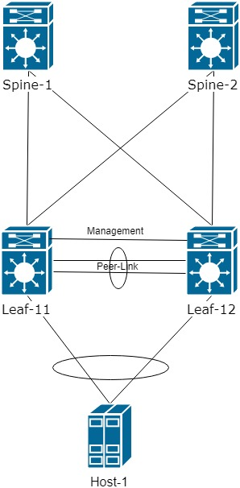

В данной заметке хочу рассмотреть основные принципы построения Underlay сетей для сетевых файбрик в ЦОД.
Топологию построим на основе сетей CLOS. Такие сети позволяют получить максимальное распределение трафика между двумя уровнями устройств - 
Spine и Leaf. 

Суть такой сети, что в ядро - Spine устанавливаются коммутаторы L3. Эти коммутаторы соединяются с каждым коммутатором уровнял Leaf. Соединения между всему 
устройства реализуется маршрутизируемыми портами - убираем недостатки L2 (в основном - STP). Так же получаем преимущества L3 - отправлять пакеты по разным линкам 
для распределения нагрузки по всем каналам.

Для примера возьмем следующую топологию: 



На схеме изображены 2 Spine, 2 Leaf и 1 хост. Хост подключается к Leaf коммутаторам через агрегированный линк L2

В данной примере использую коммутаторы Cisco Nexus 9000. 

Зададим адресацию для устройств:
```buildoutcfg
Spine-1 - 10.255.1.101
Spine-2 - 10.255.1.102

Leaf-11 - 10.255.1.11
Leaf-12 - 10.255.1.12
```

Приступим к настройке сети:

Для начала настроим IP адреса на всех устройства Underlay сети.
На Nexus у нас есть возможность задать один IP адресс на Loopback интерфейсе:
  ```buildoutcfg
interface loopback0
  description ROUTE_INT
  ip address 10.255.1.11      ! IP можем использовать с /32
  ```
на физических интерфейсах мы можем "позаимствовать" IP с Loopback. Настраимваем интерфейсы только между Spine и Leaf. На схеме выше изображен линк между Nexus. Он 
нам понадобиться позднее:
```buildoutcfg
interface ethernet1/1
  no switchport
  mtu 9216
  medium p2p     ! Настраиваем Point-to-Point линки, чтобы убрать необходимость поиска DR/BDR между Nexus
  ip unnumbered loopback0    ! для экономии и упрощения работы заимствуем IP с Loopback
  no shutdown
```
Таким образома мы:
1. Экономим IP адреса
2. Облегчаем настройку
3. Упрощаем дальнейший troubleshooting

Далее для общей связанности между всеми устройствами настроим протокол OSPF.
На Nexus необходимо включить для начала включить фунцию OSPF и только после этого можно настроить сам протокол:
```buildoutcfg
feature ospf

router ospf UNREFLAY
  router-id {ID} ! для каждого устройства задаем ID для упрощения дальнейшего TrobleShoting`a
```
На каждом интерфейсе включаем процесс OSPF. Все устройства поместим в area 0:
```buildoutcfg
interface loopback0
  ip router ospf UNDERLAY area 0.0.0.0

interface ethernet1/1-2  ! интерфейсы только между Spine и Leaf
  ip router ospf UNDERLAY area 0.0.0.0
```
Проверим, что у нас появилась базоавая IP связанность:

```buildoutcfg
10.255.1.11/32, ubest/mbest: 2/0
    *via 10.255.1.101, Eth1/4, [110/81], 00:00:03, ospf-UNDERLAY, intra
    *via 10.255.1.102, Eth1/3, [110/81], 00:00:03, ospf-UNDERLAY, intra
10.255.1.12/32, ubest/mbest: 2/0, attached
    *via 10.255.1.22, Lo0, [0/0], 00:02:20, local
    *via 10.255.1.22, Lo0, [0/0], 00:02:20, direct
10.255.1.101/32, ubest/mbest: 1/0
    *via 10.255.1.101, Eth1/4, [110/41], 00:00:06, ospf-UNDERLAY, intra
10.255.1.102/32, ubest/mbest: 1/0
    *via 10.255.1.102, Eth1/3, [110/41], 00:00:03, ospf-UNDERLAY, intra
```
В выводе таблицы маршрутизации видно, что от одного Leaf до второго Leaf есть два пути через 2 Spine.

Однако, протокол OSPF в случае падения какго-либо линка узнает об этом в худшем случае через 40 секунд. 
Не самый лучший результат, когда речь идет о ЦОД, где потеря трафика в течении одной секунды может быть равна не одному гигабиту.

Для решения этой ситуации используем протокол BFD. Так же необходимо включить сам протокол. после этого привязать к протоколу OSPF
и в финале настроить на тех интерфейсах, которые будем мониторить:

```buildoutcfg
feature bfd

bfd interval 250 min_rx 250 multiplier 4   ! настраиваем отправку hello каждые 250 милисекунд. В секунду отправится 4 hello

interface Ethernet1/1
  ip ospf bfd                       ! привязываем к физическому интерфейсу

interface Ethernet1/2
  ip ospf bfd

router ospf UNDERLAY
  bfd                               ! Привязываем BFD к протоолу OSPF
```

На виртуальных образах BFD не поддерживается в рамках Cisco Nexus 9000v. Однако на железной платформе проблем с настройкой не возникнет.

В результате настройки выше протокол BFD отслеживает состоянии канала и в случае падения канала моментально сообщит об этом процессу OSPF.


Перейдем к финальной части настройки Underlay сети - подключение хоста:

Так как хоста подключается через агрегированный канала L2, то на Cisco Nexus потребуется включить две технологии - LACP и VPC
```buildoutcfg
feature vpc
feature lacp
```
VPC - Virtual Port Channel. Создает виртуальный домен в рамках которого два Nexus представляются одним устройством для установления соединения LACP.

Настроим домен VPC между парами Leaf коммутаторов. Домен VPC должен быть одинаковым на обоих устройстваз в паре Nexus.
```buildoutcfg
vpc domain 2
  peer-keepalive destination 192.168.2.1 source 192.168.2.2 ! данные адреса настроены на интерфейсе mgmt, в нащем случае коммутаторы связаны напрямую.
                                                                                    их можно подключить и через другой коммутатор. 
!
! создаем channel-group 7 mode active на интерфейсах между Nexus
!
interface ethernet 1/6-7
 channel-group 7 mode active
 no shutdown
interface port-channel7
 no shutdown  
 vpc peer-link ! указываем, что этот port-channel является служебным линком между парой устройств. 
```
Через peer-link осуществялется только синхронизация служебной информации между коммутаторами. Трафика из Data-plane тут не будет.

Проверим, что VPC синхронизировался и все ок:
```buildoutcfg
show vpc

vPC domain id                     : 1
Peer status                       : peer adjacency formed ok
vPC keep-alive status             : peer is alive
Configuration consistency status  : success
Per-vlan consistency status       : success
Type-2 consistency status         : success
vPC role                          : primary
Number of vPCs configured         : 0
Peer Gateway                      : Disabled
Dual-active excluded VLANs        : -
Graceful Consistency Check        : Enabled
Auto-recovery status              : Disabled
Delay-restore status              : Timer is off.(timeout = 30s)
Delay-restore SVI status          : Timer is off.(timeout = 10s)
Operational Layer3 Peer-router    : Disabled

```
Далее настраиваем LACP в сторону Хоста. На каждом Leaf настройка должна быть идентична:
```buildoutcfg
interface Ethernet1/6
  switchport mode trunk
  channel-group 5 mode active
!
!
interface port-channel5
  switchport mode trunk
  vpc 5  ! для каждого Port-channel настройка уникальная
```
Проверим, что не возникло никаких проблем с VPC:
```buildoutcfg
vPC status
----------------------------------------------------------------------------
Id    Port          Status Consistency Reason                Active vlans
--    ------------  ------ ----------- ------                ---------------
5     Po5           up     success     success               1
```

На данном этапе будем считать настройку базовой Underlay сети выполненной.